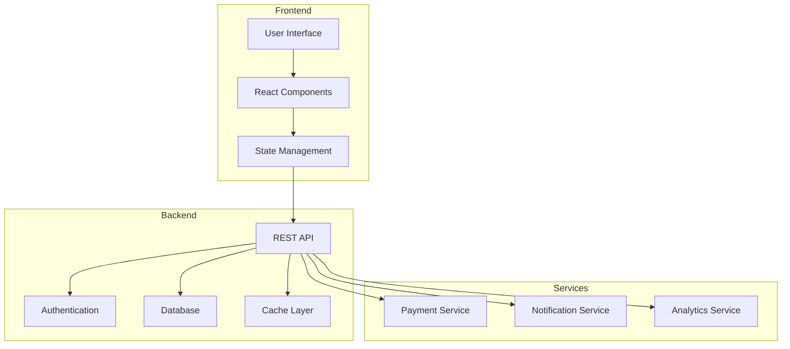
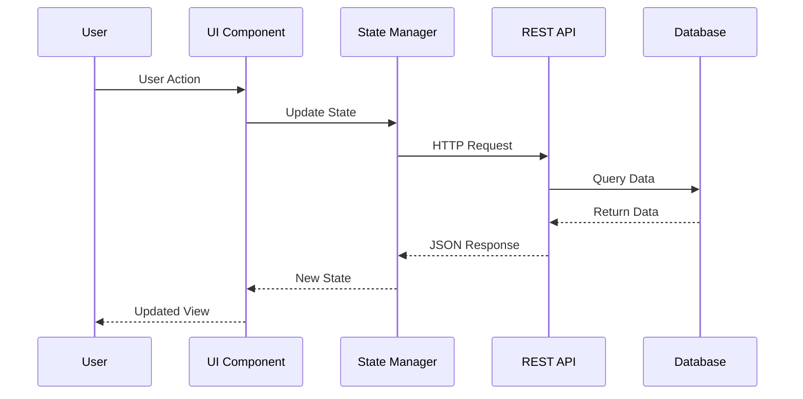

# Core Concepts

This section covers the fundamental concepts that form the foundation of our platform.

## Architecture Overview

Our application follows a modern microservices architecture with the following key components:



### Frontend Layer

The presentation layer built with React provides:
- Responsive user interface
- State management with Context API
- Component-based architecture
- Real-time data updates

### Backend Services

Our backend infrastructure consists of:
- RESTful API endpoints
- Authentication and authorization
- Data processing pipelines
- Caching mechanisms

## State Management

We use a combination of React hooks and Context API for state management:

```javascript
const StateContext = React.createContext();

export function StateProvider({ children }) {
  const [state, setState] = useState(initialState);

  return (
    <StateContext.Provider value={{ state, setState }}>
      {children}
    </StateContext.Provider>
  );
}
```

## Data Flow

Understanding how data flows through the application:



1. **User Interaction** - User performs an action in the UI
2. **State Update** - Component state is updated
3. **API Call** - Request sent to backend
4. **Data Processing** - Backend processes the request
5. **Response** - Data returned to frontend
6. **UI Update** - Interface reflects new state

## Component Architecture

Our components follow these design principles:

### Atomic Design

- **Atoms**: Basic building blocks (buttons, inputs)
- **Molecules**: Simple component groups
- **Organisms**: Complex component sections
- **Templates**: Page-level layouts
- **Pages**: Complete screens

### Component Guidelines

```javascript
// Example component structure
function Component({ props }) {
  // State and hooks
  const [state, setState] = useState();

  // Effects
  useEffect(() => {
    // Side effects
  }, [dependencies]);

  // Event handlers
  const handleEvent = () => {
    // Logic
  };

  // Render
  return (
    <div>
      {/* JSX */}
    </div>
  );
}
```

## Security Considerations

Security is built into every layer:

- Input validation and sanitization
- HTTPS encryption
- JWT token authentication
- Role-based access control
- API rate limiting