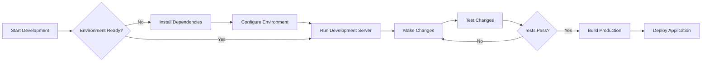

# Getting Started

Welcome to our comprehensive documentation. This guide will help you get started with our platform quickly and efficiently.

## Prerequisites

Before you begin, ensure you have the following installed:

- Node.js (version 14 or higher)
- npm or yarn package manager
- Git for version control

## Installation

Follow these steps to install and set up the project:

```bash
# Clone the repository
git clone https://github.com/your-repo/your-project.git

# Navigate to the project directory
cd your-project

# Install dependencies
npm install
```

## Project Structure

Understanding the project structure helps you navigate the codebase effectively:

```
project/
├── src/
│   ├── components/
│   ├── pages/
│   ├── services/
│   └── utils/
├── public/
├── docs/
└── package.json
```

### Development Workflow



## Configuration

Configure your environment variables by creating a `.env` file:

```env
REACT_APP_API_URL=https://api.example.com
REACT_APP_ENV=development
```

## Running the Application

Start the development server:

```bash
npm start
```

The application will be available at `http://localhost:3000`

## Next Steps

- Explore the [Core Concepts](/docs/core-concepts) to understand the fundamentals
- Check out the [API Reference](/docs/api-reference) for detailed API documentation
- View [Examples](/docs/examples) for practical implementation patterns