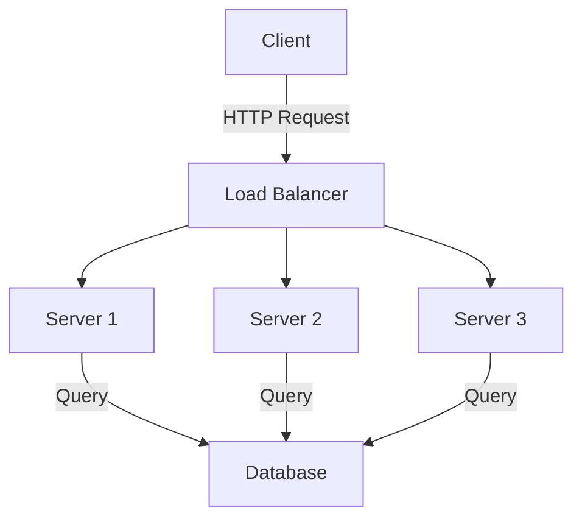
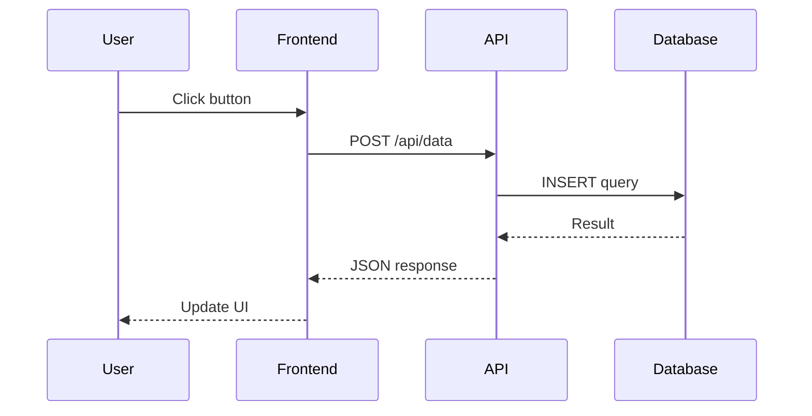

# Advanced Features

This section covers advanced features including diagrams, complex mathematics, and more.

## Mermaid Diagrams

Our documentation supports Mermaid diagrams for visualizing workflows and architectures:



## Sequence Diagram



## Advanced Mathematics

### Matrix Operations

The determinant of a 2x2 matrix is calculated as:

$$
\det(A) = \begin{vmatrix}
a & b \\
c & d
\end{vmatrix} = ad - bc
$$

### Calculus

The derivative of $f(x) = x^n$ is:

$$\frac{d}{dx}[x^n] = nx^{n-1}$$

### Integral

The definite integral from $a$ to $b$:

$$\int_a^b f(x)dx = F(b) - F(a)$$

## Images with Captions


*Figure 1: System architecture showing the main components*

## Warning Blocks

> **Warning**: This operation is destructive and cannot be undone. Make sure you have backups before proceeding.

## Success Blocks

> **Success**: Configuration completed successfully! Your system is now ready to use.

## Advanced Code Examples

### TypeScript with Generics

```typescript
interface ApiResponse<T> {
  data: T;
  status: number;
  message: string;
}

class DataService<T> {
  private baseUrl: string;

  constructor(baseUrl: string) {
    this.baseUrl = baseUrl;
  }

  async fetchData(endpoint: string): Promise<ApiResponse<T>> {
    const response = await fetch(`${this.baseUrl}/${endpoint}`);
    const data = await response.json();

    return {
      data: data as T,
      status: response.status,
      message: response.statusText
    };
  }
}

// Usage
interface User {
  id: number;
  name: string;
  email: string;
}

const userService = new DataService<User>('https://api.example.com');
const userResponse = await userService.fetchData('users/1');
```

## Tables

| Feature | Basic | Pro | Enterprise |
|---------|-------|-----|------------|
| Users | 10 | 100 | Unlimited |
| Storage | 10GB | 100GB | 1TB |
| Support | Email | Priority | 24/7 Phone |
| Price | $10/mo | $50/mo | Custom |