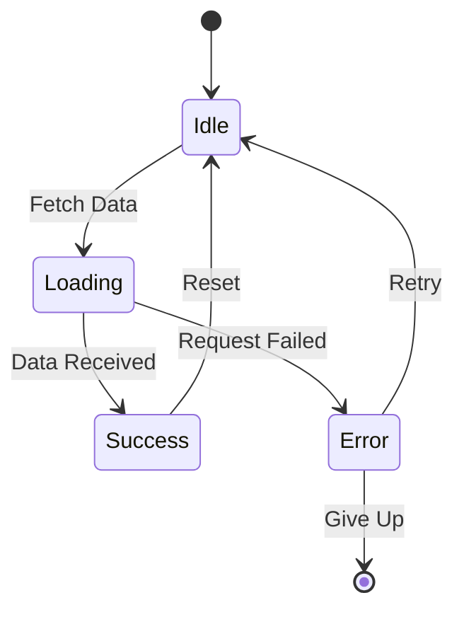
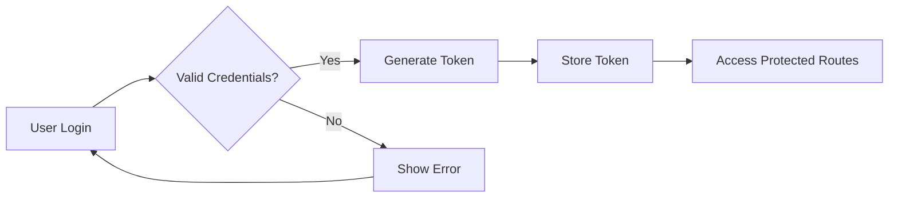

# API Reference

Complete API documentation for the documentation system.

## REST Endpoints

### GET /api/pages

Retrieves all available documentation pages.

```http
GET /api/pages HTTP/1.1
Host: api.example.com
Authorization: Bearer your-token-here
```

**Response:**

```json
{
  "pages": [
    {
      "id": "getting-started",
      "title": "Getting Started",
      "path": "getting-started.mdx",
      "children": []
    },
    {
      "id": "api-reference",
      "title": "API Reference",
      "path": "api-reference.mdx",
      "children": []
    }
  ]
}
```

### GET /api/page/:id

Retrieves content for a specific page.

```http
GET /api/page/getting-started HTTP/1.1
Host: api.example.com
```

**Response:**

```json
{
  "id": "getting-started",
  "title": "Getting Started",
  "content": "# Getting Started\n\nContent here...",
  "path": "getting-started.mdx"
}
```

### GET /api/search

Search documentation pages.

**Parameters:**

| Parameter | Type | Required | Description |
|-----------|------|----------|-------------|
| q | string | Yes | Search query |
| limit | number | No | Max results (default: 20) |

```http
GET /api/search?q=installation HTTP/1.1
Host: api.example.com
```

## State Diagram



## Authentication Flow



## Python SDK Usage

```python
from documentation_sdk import Client

# Initialize the client
client = Client(
    api_key="your-api-key",
    base_url="https://api.example.com"
)

# Fetch all pages
pages = client.get_pages()
for page in pages:
    print(f"Page: {page.title}")

# Search for content
results = client.search("installation")
for result in results:
    print(f"Found: {result.title} (score: {result.score})")

# Get specific page content
page = client.get_page("getting-started")
print(page.content)
```

## Error Handling

> **Important**: Always handle errors gracefully to ensure a good user experience.

```javascript
try {
  const response = await fetch('/api/pages');
  if (!response.ok) {
    throw new Error(`HTTP error! status: ${response.status}`);
  }
  const data = await response.json();
  // Process data
} catch (error) {
  console.error('Failed to fetch pages:', error);
  // Show user-friendly error message
}
```

## Rate Limiting

The API implements rate limiting to ensure fair usage:

- **Anonymous users**: 100 requests per hour
- **Authenticated users**: 1000 requests per hour
- **Premium users**: 10000 requests per hour

Rate limit information is included in response headers:

```
X-RateLimit-Limit: 1000
X-RateLimit-Remaining: 999
X-RateLimit-Reset: 1628793600
```

## WebSocket Events

For real-time updates, connect to our WebSocket endpoint:

```javascript
const ws = new WebSocket('wss://api.example.com/ws');

ws.on('connect', () => {
  console.log('Connected to WebSocket');
});

ws.on('page-updated', (data) => {
  console.log('Page updated:', data.pageId);
});

ws.on('search-index-updated', () => {
  console.log('Search index has been updated');
});
```