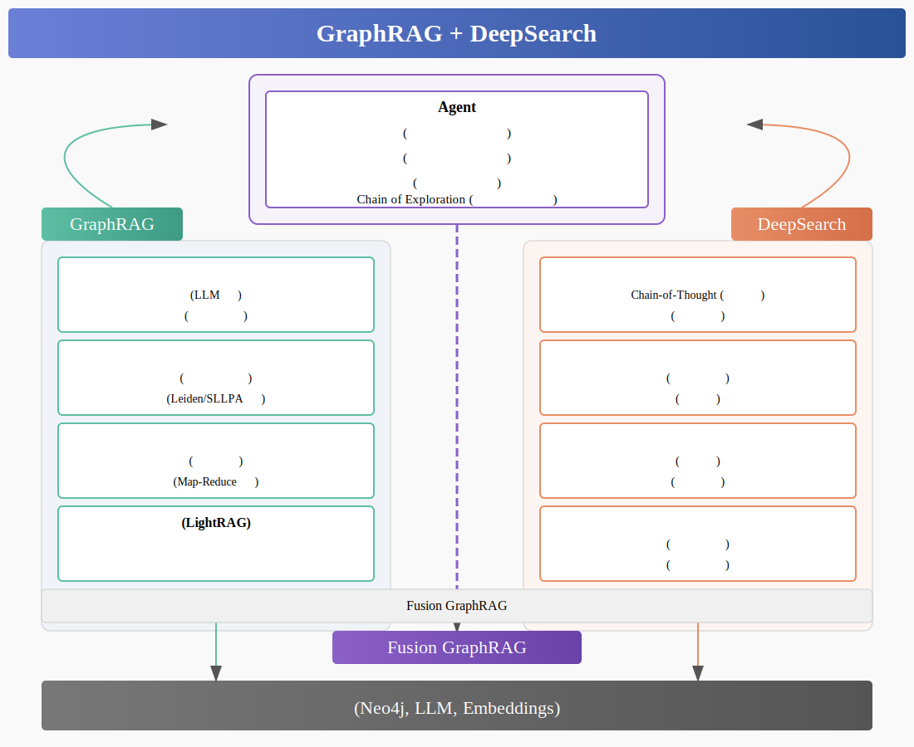
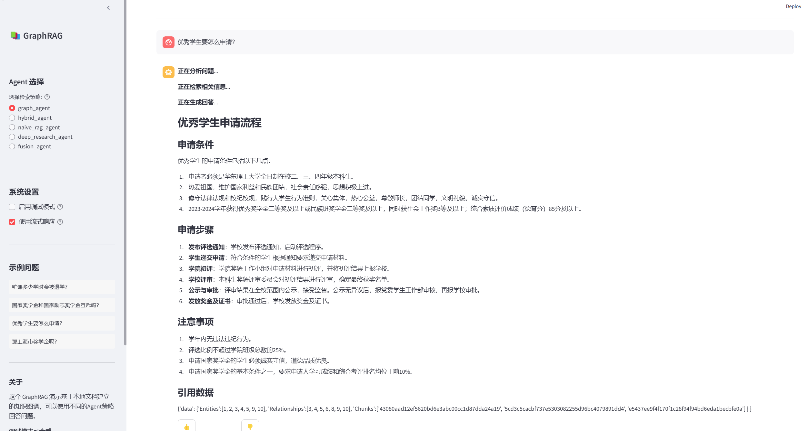
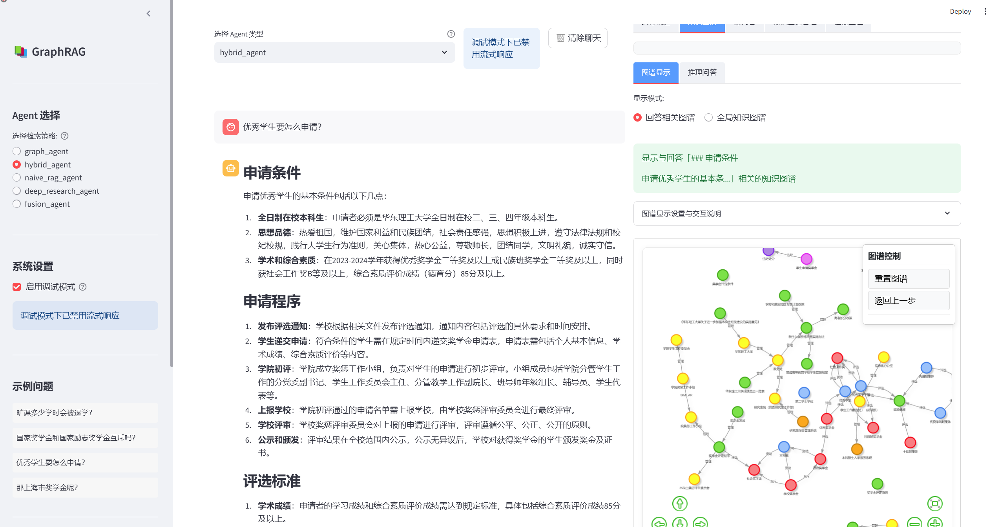
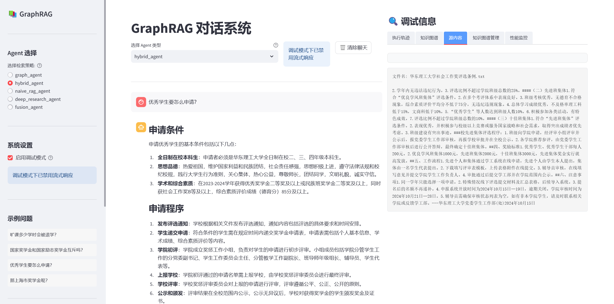
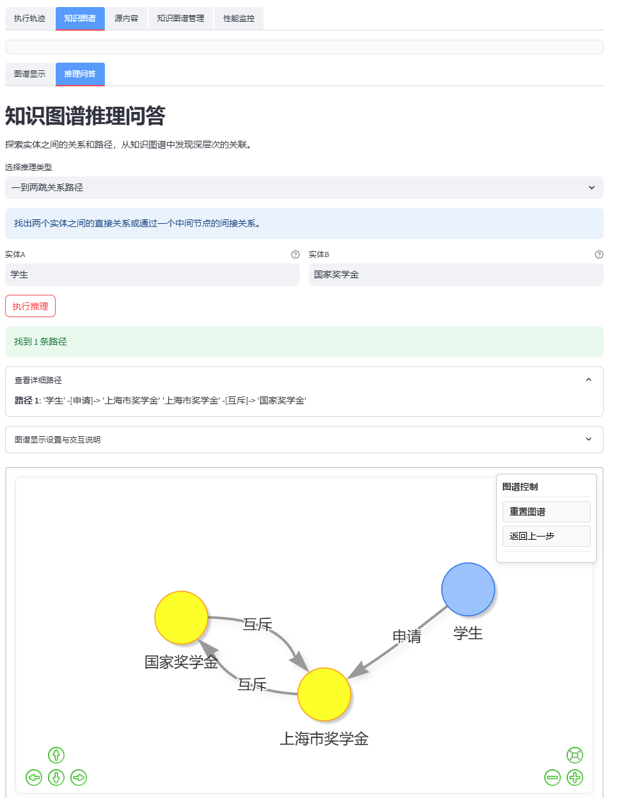

# GraphRAG + DeepSearch Implementation and Q&A System (Agent) Construction

This project focuses on combining **GraphRAG** with **private domain Deep Search** to implement an interpretable and reasoning-capable intelligent Q&A system, while integrating multi-agent collaboration and knowledge graph enhancement to build a complete RAG intelligent interaction solution.

> 💡 Inspired by retrieval-augmented reasoning and deep search scenarios, exploring the integration path of RAG and Agent in future applications.

## 🏠 Project Architecture Diagram

**Note: This project was officially included by [deepwiki](https://deepwiki.org/) on 4.28, which helps understand the overall project code and core working principles, address: https://deepwiki.com/1517005260/graph-rag-agent**

Generated by Claude



## 📂 Project Structure

```
graph-rag-agent/
├── agent/                  # 🤖 Agent Module - Core Interaction Layer
│   ├── base.py             # Agent Base Class
│   ├── graph_agent.py      # Graph Structure-based Agent
│   ├── hybrid_agent.py     # Hybrid Search Agent
│   ├── naive_rag_agent.py  # Simple Vector Retrieval Agent
│   ├── deep_research_agent.py # Deep Research Agent
│   ├── fusion_agent.py     # Multi-Agent Collaboration Agent
│   └── agent_coordinator.py # Multi-Agent Coordinator
├── assets/                 # 🖼️ Static Resources
│   ├── deepsearch.svg      # RAG Evolution Diagram
│   └── start.md            # Quick Start Documentation
├── build/                  # 🏗️ Knowledge Graph Construction Module
│   ├── main.py             # Construction Entry
│   ├── build_graph.py      # Basic Graph Construction
│   ├── build_index_and_community.py # Index and Community Construction
│   ├── build_chunk_index.py # Text Chunk Index Construction
│   ├── incremental/        # Incremental Update Submodule
│   └── incremental_update.py # Incremental Update Management
├── CacheManage/            # 📦 Cache Management Module
│   ├── manager.py          # Unified Cache Manager
│   ├── backends/           # Storage Backends
│   ├── models/             # Data Models
│   └── strategies/         # Cache Key Generation Strategies
├── community/              # 🔍 Community Detection and Summary Module
│   ├── detector/           # Community Detection Algorithms
│   └── summary/            # Community Summary Generation
├── config/                 # ⚙️ Configuration Module
│   ├── neo4jdb.py          # Database Connection Management
│   ├── prompt.py           # Prompt Templates
│   └── settings.py         # Global Configuration
├── evaluator/              # 📊 Evaluation System
│   ├── core/               # Core Evaluation Components
│   ├── metrics/            # Evaluation Metrics Implementation
│   └── test/               # Evaluation Test Scripts
├── frontend/               # 🖥️ Frontend Interface
│   ├── app.py              # Application Entry
│   ├── components/         # UI Components
│   └── utils/              # Frontend Utilities
├── graph/                  # 📈 Graph Construction Module
│   ├── core/               # Core Components
│   ├── extraction/         # Entity Relationship Extraction
│   ├── indexing/           # Index Management
│   └── processing/         # Entity Processing
├── model/                  # 🧩 Model Management
│   └── get_models.py       # Model Initialization
├── processor/              # 📄 Document Processor
│   ├── document_processor.py # Document Processing Core
│   ├── file_reader.py      # Multi-format File Reading
│   └── text_chunker.py     # Text Chunking
├── search/                 # 🔎 Search Module
│   ├── local_search.py     # Local Search
│   ├── global_search.py    # Global Search
│   └── tool/               # Search Toolset
│       ├── naive_search_tool.py    # Simple Search
│       ├── deep_research_tool.py   # Deep Research Tool
│       └── reasoning/              # Reasoning Components
├── server/                 # 🖧 Backend Service
│   ├── main.py             # FastAPI Application Entry
│   ├── models/             # Data Models
│   ├── routers/            # API Routes
│   └── services/           # Business Logic
└── test/                   # 🧪 Test Module
    ├── search_with_stream.py    # Streaming Output Test
    └── search_without_stream.py # Standard Output Test
```

**Additionally, each module has a separate readme to introduce the module's functionality**

## 🚀 Related Resources

- [As LLM reasoning capabilities continue to strengthen, where do RAG and Agent go?](https://www.bilibili.com/video/BV1i6RNYpEwV)  
- [Enterprise-level Knowledge Graph Interactive Q&A System Solution](https://www.bilibili.com/video/BV1U599YrE26)  
- [Jean - Complete Process of Building Graphs with Domestic LLM + LangChain + Neo4j](https://zhuanlan.zhihu.com/p/716089164)
- [GraphRAG vs DeepSearch? The GraphRAG proposer gives you the answer](https://mp.weixin.qq.com/s/FOT4pkEPHJR8xFvcVk1YFQ)


## ✨ Project Highlights

- **Complete GraphRAG Reproduction from Scratch**: Fully implemented the core functionality of GraphRAG, representing knowledge as graph structures
- **Innovative Fusion of DeepSearch and GraphRAG**: Existing DeepSearch frameworks are mainly based on vector databases; this project innovatively combines them with knowledge graphs
- **Multi-Agent Collaborative Architecture**: Implements collaborative work of different types of Agents, improving complex problem handling capabilities
- **Complete Evaluation System**: Provides 20+ evaluation metrics for comprehensive system performance measurement
- **Incremental Update Mechanism**: Supports dynamic incremental construction of knowledge graphs with intelligent deduplication
- **Thought Process Visualization**: Displays AI reasoning trajectories, improving interpretability and transparency

## 🏁 Quick Start

Please refer to: [Quick Start Documentation](./assets/start.md)

## 🧰 Functional Modules

### Graph Construction and Management

- **Multi-format Document Processing**: Supports TXT, PDF, MD, DOCX, DOC, CSV, JSON, YAML/YML formats
- **LLM-driven Entity Relationship Extraction**: Uses large language models to identify entities and relationships from text
- **Incremental Update Mechanism**: Supports dynamic updates on existing graphs with intelligent conflict handling
- **Community Detection and Summarization**: Automatically identifies knowledge communities and generates summaries, supporting Leiden and SLLPA algorithms
- **Consistency Validation**: Built-in graph consistency checking and repair mechanisms

### GraphRAG Implementation

- **Multi-level Retrieval Strategies**: Supports local search, global search, hybrid search and other modes
- **Graph-enhanced Context**: Uses graph structures to enrich retrieval content, providing more comprehensive knowledge background
- **Chain of Exploration**: Implements multi-step exploration capabilities on knowledge graphs
- **Community-aware Retrieval**: Optimizes search results based on knowledge community structures

### DeepSearch Fusion

- **Multi-step Think-Search-Reason**: Supports decomposition and deep exploration of complex problems
- **Evidence Chain Tracking**: Records evidence sources for each reasoning step, improving interpretability
- **Thought Process Visualization**: Real-time display of AI reasoning trajectories
- **Multi-path Parallel Search**: Simultaneously executes multiple search strategies, comprehensively utilizing different knowledge sources

### Multiple Agent Implementations

- **NaiveRagAgent**: Basic vector retrieval Agent, suitable for simple questions
- **GraphAgent**: Graph structure-based Agent, supports relationship reasoning
- **HybridAgent**: Agent combining multiple retrieval methods
- **DeepResearchAgent**: Deep research Agent supporting multi-step reasoning for complex problems
- **FusionGraphRAGAgent**: Fusion Agent combining advantages of multiple strategies

### System Evaluation and Monitoring

- **Multi-dimensional Evaluation**: Includes answer quality, retrieval performance, graph evaluation and deep research evaluation
- **Performance Monitoring**: Tracks API call latency and optimizes system performance
- **User Feedback Mechanism**: Collects user evaluations of answers for continuous system improvement

### Frontend and Backend Implementation

- **Streaming Response**: Supports real-time streaming display of AI-generated content
- **Interactive Knowledge Graph**: Provides Neo4j-style graph interaction interface
- **Debug Mode**: Developers can view execution traces and search processes
- **RESTful API**: Complete backend API design supporting extended development

## 🖥️ Simple Demo

### Terminal Test Output:

```bash
cd test/
python search_with_stream.py

# This example tests FusionGraphRAGAgent output, other Agents can be tested by uncommenting in test scripts
Start test: 2025-04-05 21:55:04

===== Start Streaming Agent Test =====

Enhanced deep research tool loaded

===== Test Query: What are the application conditions for excellent students? =====

[Test] FusionGraphRAGAgent - Streaming - Query: 'What are the application conditions for excellent students?'
Starting to receive streaming output (max wait 300 seconds)...
Performance metrics - fast_cache_check: 1.0043s
DEBUG - LLM keyword results: {
    "low_level": ["student", "institutions"],
    "high_level": ["comparison", "criteria", "educat...
Building prefix dict from the default dictionary ...
Loading model from cache /tmp/jieba.cache
Loading model cost 0.570 seconds.
Prefix dict has been built successfully.
Query graph construction completed, containing 5 entities and 0 relationships, took 0.00 seconds
DEBUG - LLM keyword results: {
    "low_level": ["Institution A", "excellent student"],
    "high_level": ["criteria", "define", ...
[Dual-path search] LLM evaluation: Both results are valuable, merging results
DEBUG - LLM keyword results: {
    "low_level": ["Institution B"],
    "high_level": ["criteria", "excellent student", "definition...
[Dual-path search] LLM evaluation: Precise query results are more specific and valuable
DEBUG - LLM keyword results: {
    "low_level": ["student", "institutions"],
    "high_level": ["comparison", "criteria", "excell...
[Validation] Answer passed keyword relevance check
DEBUG - LLM keyword results: {
    "low_level": ["student admission", "top universities"],
    "high_level": ["criteria", "excell...
Query graph construction completed, containing 5 entities and 0 relationships, took 0.00 seconds
DEBUG - LLM keyword results: {
    "low_level": ["excellent student", "top universities"],
    "high_level": ["academic qualifica...
[Dual-path search] LLM evaluation: Precise query results are more specific and valuable
DEBUG - LLM keyword results: {
    "low_level": ["student admission", "top universities"],
    "high_level": ["extracurricular ac...
[Dual-path search] LLM evaluation: Precise query results are more specific and valuable
DEBUG - LLM keyword results: {
    "low_level": ["student", "universities"],
    "high_level": ["admission criteria", "excellence...
[Validation] Answer did not contain any high-level keywords: ['admission criteria', 'excellence', 'higher education']
Reached maximum wait time of 300 seconds, ending early

[Completed] Streaming query completed
- Total time: 414.15 seconds
- First chunk delay: 1.00 seconds
- Number of chunks: 14
- Total characters: 766 characters

Result:
**Analyzing problem and formulating retrieval plan**...

**Retrieval plan formulation completed**
- Complexity assessment: 0.60
- Requires global view: Yes
- Requires relationship path tracking: No
- Contains time-related content: No
- Involves knowledge domains: Education, Admission Policies, Student Assessment

**Executing task 1/5**: exploration - Comparison of excellent student criteria across different institutions
**Starting deep exploration**...
✓ Deep exploration completed

**Executing task 2/5**: local_search - Specific academic achievements or qualifications required for recognition as an excellent student
✓ Local search completed

**Executing task 3/5**: global_search - General application criteria for excellent students in various educational institutions
✓ Global search completed

**Executing task 4/5**: local_search - Policies governing how excellent students are defined and assessed
✓ Local search completed

**Executing task 5/5**: exploration - Detailed criteria for excellent student admission in top universities
**Starting deep exploration**...
✓ Deep exploration completed


===== Test Query: How much is the academic scholarship? =====

[Test] FusionGraphRAGAgent - Streaming - Query: 'How much is the academic scholarship?'
Starting to receive streaming output (max wait 300 seconds)...
Performance metrics - fast_cache_check: 0.9272s
DEBUG - LLM keyword results: {
    "low_level": ["institutions", "scholarship offerings"],
    "high_level": ["education", "schol...
Query graph construction completed, containing 5 entities and 0 relationships, took 0.00 seconds
DEBUG - LLM keyword results: {
    "low_level": ["institutions", "scholarships"],
    "high_level": ["notable", "offer", "educati...
[Dual-path search] LLM evaluation: Knowledge base query results are more specific and valuable
DEBUG - LLM keyword results: {
    "low_level": ["institutions", "scholarships"],
    "high_level": ["types"]
}
[Dual-path search] LLM evaluation: Knowledge base query results are more specific and valuable
DEBUG - LLM keyword results: {
    "low_level": ["institutions", "scholarship offerings"],
    "high_level": ["education", "finan...
[Validation] Answer passed keyword relevance check

[Completed] Streaming query completed
- Total time: 226.51 seconds
- First chunk delay: 0.93 seconds
- Number of chunks: 18
- Total characters: 1230 characters

Result:
**Analyzing problem and formulating retrieval plan**...

**Retrieval plan formulation completed**
- Complexity assessment: 0.50
- Requires global view: Yes
- Requires relationship path tracking: No
- Contains time-related content: No
- Involves knowledge domains: Education, Finance, Scholarship Programs

**Executing task 1/6**: exploration - Explore different institutions and their scholarship offerings
**Starting deep exploration**...
✓ Deep exploration completed

**Executing task 2/6**: local_search - Average amount of funds awarded by academic scholarships
✓ Local search completed

**Executing task 3/6**: global_search - Statistics on academic scholarship funding trends
✓ Global search completed

**Executing task 4/6**: global_search - Overview of academic scholarships
✓ Global search completed

**Executing task 5/6**: global_search - Types and amounts of financial aid available for students
✓ Global search completed

**Executing task 6/6**: local_search - Financial aid offices or resources for further information
✓ Local search completed

**Integrating all retrieval results, generating final answer**...

**Integrating all retrieval results, generating final answer**...


Based on the provided retrieval results, we can understand that at East China University of Science and Technology, academic scholarship amounts are divided according to different levels, with the following amounts and proportions for each level:

1. **Special Scholarship**: 5000 yuan/person/academic year, accounting for 2% of recipients.
2. **First-class Scholarship**: 3000 yuan/person/academic year, accounting for 3% of recipients.
3. **Second-class Scholarship**: 2000 yuan/person/academic year, accounting for 10% of recipients.
4. **Third-class Scholarship**: 1000 yuan/person/academic year, accounting for 25% of recipients.

Based on these different levels of scholarship amounts and proportions, the average scholarship amount per award-winning student can be calculated through weighted average to be approximately 640 yuan.

The establishment and distribution of these scholarships are based on students' comprehensive grades and moral education scores. The school encourages and supports students with excellent character and academic performance through this method. For each student applying for scholarships, the school has strict evaluation standards and procedures to ensure scholarships are awarded to qualified students.

In addition to academic scholarships, East China University of Science and Technology also provides other types of assistance programs, such as national student loans and inspirational scholarships, to help financially disadvantaged students complete their studies.

If you have other questions about scholarship types or application processes, please refer to the official guidelines of relevant school departments or further consult the school's student financial aid management center.


===== Test Query: What are the standards for college English exams? =====

[Test] FusionGraphRAGAgent - Streaming - Query: 'What are the standards for college English exams?'
Starting to receive streaming output (max wait 300 seconds)...
Keyword extraction failed: Expecting value: line 1 column 1 (char 0)
Performance metrics - fast_cache_check: 1.0581s
DEBUG - LLM keyword results: {
    "low_level": ["各国", "大学", "英语考试"],
    "high_level": ["标准", "比较"]
}
Query graph construction completed, containing 5 entities and 0 relationships, took 0.00 seconds
DEBUG - LLM keyword results: {
    "low_level": ["大学", "英语考试", "国家"],
    "high_level": ["教育标准", "对比分析", "语言能力评估"]
}
[Dual-path search] LLM evaluation: Precise query results are more specific and valuable
DEBUG - LLM keyword results: {
    "low_level": ["大学", "英语考试", "各国"],
    "high_level": ["难度", "形式", "标准"]
}
[Dual-path search] LLM evaluation: Knowledge base query results are more specific and valuable
DEBUG - LLM keyword results: {
    "low_level": [],
    "high_level": ["各国", "大学", "英语考试", "标准", "比较"]
}
[Validation] Answer passed keyword relevance check

[Completed] Streaming query completed
- Total time: 224.52 seconds
- First chunk delay: 1.06 seconds
- Number of chunks: 16
- Total characters: 1126 characters

Result:
**Analyzing problem and formulating retrieval plan**...

**Retrieval plan formulation completed**
- Complexity assessment: 0.70
- Requires global view: Yes
- Requires relationship path tracking: No
- Contains time-related content: Yes
- Involves knowledge domains: Education System, Language Learning, Exam Assessment

**Executing task 1/5**: global_search - Impact of college English exams on students
✓ Global search completed

**Executing task 2/5**: local_search - Changes in college English exam standards over time
✓ Local search completed

**Executing task 3/5**: exploration - Comparison of college English exam standards across countries
**Starting deep exploration**...
✓ Deep exploration completed

**Executing task 4/5**: global_search - General overview of college English exams
✓ Global search completed

**Executing task 5/5**: local_search - Detailed introduction to college English exam standards
✓ Local search completed

**Integrating all retrieval results, generating final answer**...

**Integrating all retrieval results, generating final answer**...


### College English Exam Standards

Based on local and global retrieval results, we can understand several main aspects of college English exam standards, including exam purposes, exemption conditions, curriculum design and assessment methods.

#### 1. Background and Objectives
The goal of college English courses is to cultivate students' English application abilities, academic or professional English communication skills, and cross-cultural communication capabilities to meet the learning needs of different levels of students and improve teaching quality. [Result 1]

#### 2. Exam Exemption Standards
College English exemption conditions are related to national unified exam scores:
- **National College English Test Band 4**: Those who score 480 or above on Band 4 can be exempted from the "College English" degree exam. [Result 2]
- **National College English Test Band 6**: Those who score 425 or above on Band 6 can also be exempted from the "College English" degree exam. [Result 2]

#### 3. Curriculum Design and Assessment
College English courses consist of three stages of courses, and all participating students need to pass the final assessment of each stage and complete the required credits. [Results 1, 2]

#### 4. Degree Exam Arrangements
Degree exams are usually arranged in the final academic year before graduation, and students who fail can take makeup exams. [Result 2]

#### 5. International Standards Comparison
Different countries use different English exams, for example, the UK typically uses IELTS, while the US commonly uses TOEFL. Although exams differ in format across countries, they all include listening, speaking, reading, and writing components. Their purpose is to ensure students can study smoothly in English-speaking environments. [Exploration Result 1]

### Summary
College English exam standards are mainly based on national unified exam scores, ensuring students' English proficiency development through grading and makeup exam mechanisms. Additionally, countries differ in English exam standards, reflected in exam methods and scoring. Overall, the core standards of college English exams lie in assessing students' English abilities to adapt to academic or professional language environments.


===== Test Query: Xiao Ming skipped 30 class hours, hid a hair dryer, and beat up a classmate. Can he still apply for a national scholarship? =====

[Test] FusionGraphRAGAgent - Streaming - Query: 'Xiao Ming skipped 30 class hours, hid a hair dryer, and beat up a classmate. Can he still apply for a national scholarship?'
Starting to receive streaming output (max wait 300 seconds)...
Performance metrics - fast_cache_check: 1.1123s
Received 20 chunks, 824 characters total, took 101.35 seconds
DEBUG - LLM keyword results: {
    "low_level": ["旷课", "私藏物品", "暴力行为"], 
    "high_level": ["综合处理", "校园纪律管理", "行为规范"]
}
Query graph construction completed, containing 5 entities and 0 relationships, took 0.00 seconds
DEBUG - LLM keyword results: {
    "low_level": ["旷课", "学校"],
    "high_level": ["处理措施", "行为"]
}
[Dual-path search] LLM evaluation: Precise query results are more specific and valuable
DEBUG - LLM keyword results: {
    "low_level": ["私藏物品", "学校"],
    "high_level": ["处理措施", "行为", "规章制度"]
}
[Dual-path search] LLM evaluation: Precise query results are more specific and valuable
DEBUG - LLM keyword results: 
{
    "low_level": [],
    "high_level": ["旷课", "私藏物品", "暴力行为", "综合处理", "学校"]
}
[Validation] Answer passed keyword relevance check

[Completed] Streaming query completed
- Total time: 291.64 seconds
- First chunk delay: 1.11 seconds
- Number of chunks: 32
- Total characters: 2011 characters

Result:
**Analyzing problem and formulating retrieval plan**...

**Retrieval plan formulation completed**
- Complexity assessment: 0.80
- Requires global view: Yes
- Requires relationship path tracking: Yes
- Contains time-related content: No
- Involves knowledge domains: Education Policy, Scholarship Selection Standards, Student Discipline Regulations

The core of this question is the conditions for national scholarship selection and whether Xiao Ming's behavior meets these conditions. To answer this question, we need to understand the following information:

1. **National Scholarship Selection Conditions and Standards**: Generally speaking, national scholarship selection standards include academic performance, moral character, social performance, comprehensive quality and other aspects. Specific standards vary by country and specific educational institution, but usually have requirements for character and discipline.

2. **Impact of Xiao Ming's Behavior**: Skipping classes, hiding prohibited items, and beating classmates are all negative behaviors in general school discipline and moral evaluation, which will have an impact on Xiao Ming's selection qualifications. However, the specific degree of impact and whether it absolutely excludes him from scholarship eligibility depends on specific school regulations and circumstances...

**Executing task 1/7**: local_search - School regulations on skipping classes
✓ Local search completed

**Executing task 2/7**: local_search - School regulations on penalties for hiding dangerous items
✓ Local search completed

**Executing task 3/7**: local_search - School discipline and penalty regulations for teachers and students
✓ Local search completed

**Executing task 4/7**: local_search - School regulations on penalties for student violence
✓ Local search completed

**Executing task 5/7**: global_search - National scholarship selection standards
✓ Global search completed

**Executing task 6/7**: chain_exploration - Specific requirements for discipline violations in selection standards
**Starting Chain of Exploration**...
- Extracting entities from existing results: National Scholarship, School Discipline Regulations
- Exploration paths:
  • Step 0: National Scholarship
  • Step 0: School Discipline Regulations
  • Step 1: Scholarship Review Principles
  • Step 1: Review Committee
  • Step 1: Student Academic Records
- Found 21 related contents
✓ Chain of Exploration completed

**Executing task 7/7**: exploration - School's comprehensive handling of skipping classes, hiding items, and violent behavior
**Starting deep exploration**...
✓ Deep exploration completed

**Final thinking based on all search results**...

Based on the provided verification result summary, we can see that all hypotheses were not supported, rejected, or marked as uncertain. In this situation, we lack specific data to support or oppose any hypothesis. For this scenario, my updated thinking process is:

1. **Lack of data support:** In the current verification results, no hypothesis received clear support, rejection, or uncertain marking, which means we lack sufficient data or evidence for further analysis and conclusions.

2. **Continue collecting data:** Since there are currently no definitive results, it is recommended to strengthen data collection and analysis to provide stronger evidence support for each hypothesis. This includes designing new experiments, seeking additional data sources, increasing sample sizes, etc....

**Integrating all retrieval results, generating final answer**...

**Integrating all retrieval results, generating final answer**...


Based on the retrieval results, answering whether Xiao Ming can apply for a national scholarship requires considering the impact of his behavior on scholarship selection conditions. The following is the analysis:

### I. National Scholarship Selection Conditions

National scholarship evaluation standards not only emphasize excellent academic performance (such as ranking in the top 10%), but also require applicants to have noble moral character and outstanding performance, such as participating in social service or abiding by the constitution and laws. These requirements show that moral character and disciplinary performance are important considerations in the selection.

### II. Behavior Analysis and Impact

#### 1. **Skipping Classes**

According to school disciplinary regulations, skipping classes is a serious violation. Unauthorized absence from courses exceeding a certain number of hours can result in warnings, demerits, or more serious penalties. Therefore, skipping 30 class hours may have a significant negative impact on scholarship selection.

#### 2. **Hiding Dangerous Items**

Schools have clear penalty measures for hiding dangerous items, such as violations of electrical appliance use, which may result in warnings or demerit penalties. This behavior not only affects personal safety but is also considered a violation of school regulations.

#### 3. **Violent Behavior**

Violent behavior such as beating classmates is usually handled seriously and may result in demerit or probation penalties. In scholarship selection, recorded violent behavior will significantly affect the assessment of students' moral character.

### III. Comprehensive Analysis and Conclusion

Since national scholarship selection requires applicants to have no serious disciplinary violations, Xiao Ming's multiple violations including skipping classes, hiding dangerous items, and violent behavior will seriously affect his moral character evaluation. Therefore, according to general selection standards, Xiao Ming does not meet the "no disciplinary record" condition, which will directly disqualify him from national scholarship selection.

Based on the above analysis, Xiao Ming cannot apply for a national scholarship due to multiple disciplinary violations. It is recommended that Xiao Ming reflect on the consequences of his behavior and work harder to comply with school regulations and actively improve his performance in the future.

### Information Sources

- School academic management regulations and disciplinary penalty provisions.
- National scholarship selection standards, including moral character assessment.


===== Test Summary =====
Successful tests: 4/4
Average total time: 289.21 seconds
Average first chunk delay: 1.03 seconds
Average number of chunks: 20.0
Test completed: 2025-04-05 22:14:29
```

It can be seen that due to embedding similarity reasons, the LLM has a probability of approximating "excellent students" (school honor title) to "national scholarship" (title ≠ scholarship). This problem needs to be solved by subsequent fine-tuning of embeddings.

### Web Demo

Q&A in non-debug mode:



Q&A in debug mode (including trajectory tracking (langgraph nodes), hit knowledge graph and document source content, knowledge graph reasoning Q&A, etc.):







## 🔮 Future Plans

1. **Automated Data Acquisition**:
   - Add scheduled crawler functionality to replace current manual document updates
   - Implement automatic resource discovery and incremental crawling

2. **Graph Construction Optimization**:
   - Use GRPO to train small models to support graph extraction
   - Reduce current DeepResearch costs and latency for graph extraction/Chain of Exploration

3. **Domain-specific Embeddings**:
   - Solve the problem of distinguishing semantically similar but conceptually different terms
   - Optimize embedding distinctions such as "excellent students" vs "national scholarships", "manslaughter" vs "intentional homicide"

4. **Agent Performance Optimization**:
   - Improve Agent framework response speed
   - Optimize multi-Agent collaboration mechanisms

5. **Project Engineering Optimization**
    - Project structure optimization, current project structure is too redundant and scattered
    - Cache optimization, current cache can only hit completely identical queries

## 🙏 References and Acknowledgments

- [GraphRAG](https://github.com/microsoft/graphrag) – Microsoft's open-source knowledge graph enhanced RAG framework  
- [llm-graph-builder](https://github.com/neo4j-labs/llm-graph-builder) – Neo4j's official LLM graph building tool  
- [LightRAG](https://github.com/HKUDS/LightRAG) – Lightweight knowledge-enhanced generation solution  
- [deep-searcher](https://github.com/zilliztech/deep-searcher) – Zilliz team's open-source private domain semantic search framework  
- [ragflow](https://github.com/infiniflow/ragflow) – Enterprise-level RAG system

## Star History

[](https://www.star-history.com/#1517005260/graph-rag-agent&Date)